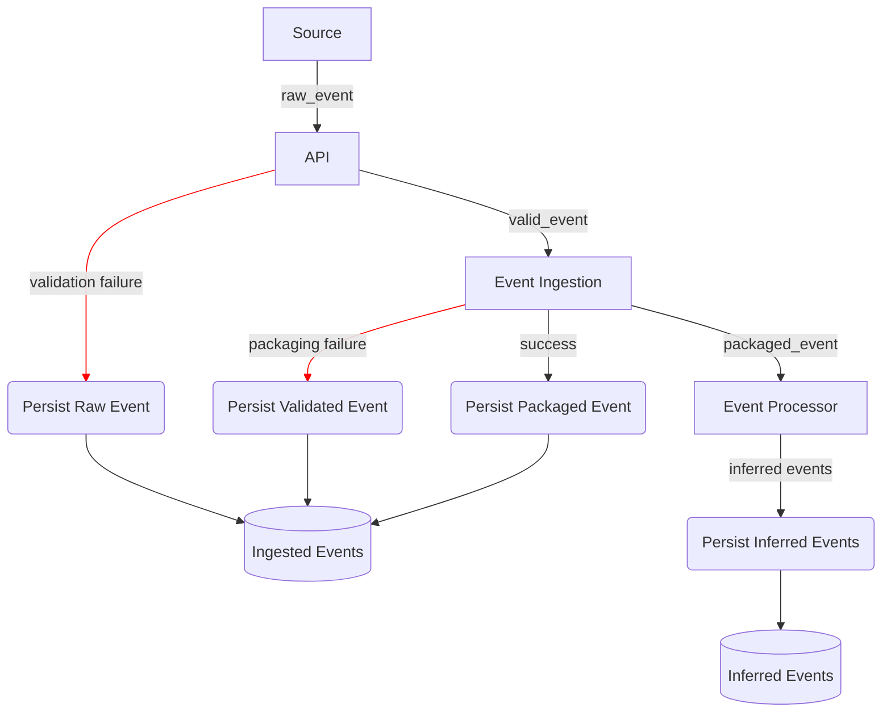

# Database Structure Revision

**ADR-ID:** 0005

**Date:** 02/24/26

## Context

The current structure of the database holds three tables: `events`, `deployments`, and `services`. The `events` table holds all incoming events which are linked to the corresponding deployment or service by foreign key id. The `services` holds all registered services and the `deployments` holds all deployment events. This current setup is muddy and blends immutable event storage with insightful and relational operational inferences.

The problem with this current setup is that there is no separation of concerns, causing uncertainty in event ownership and difficulties in the order of id generation. For example, all raw events should go into events, but a deployment event requires a deployment id and an event id. That begs the questions "Should deployment ids and event ids be the same?" or "Should deployments be registered before events?". This issue needs a comprehensive solution that decides where certain data lives in the event structure, what an incoming event looks like, how that data will be validated, and what component holds the responsibility of immutable event tracking.

## Decision

The basic structure established will contain an `ingested_events` table and a `deployments` table. All events that are ingested will follow this flow:

Because of the fail-cases, there is never an opportunity for an emitted event to not be persisted to the `ingested_events` table. After an event is validated and packaged, it is then processed for inferred events to be produced.

An example of this would be a deployment event being emitted and persisted to the `ingested_events`. After context is gathered and the event is packaged, the Event Processor can infer either a new deployment event or and update to an existing one. This will be stored to any other table in the database that holds inferred events (`deployments` table for now).

## Consequences

This establishes clear separation between immutable events and inferred events, while also leaving the event inference process scalable. More tables will be added in the future while maintaining the immutability of all recieved events.

This removes the concern of auditability, but also increases the amount of duplication and raw storage volume. Because of this, the storage of all inferred events should be highly optimized for normalization and efficiency, avoiding duplication at all costs.
